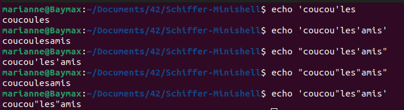
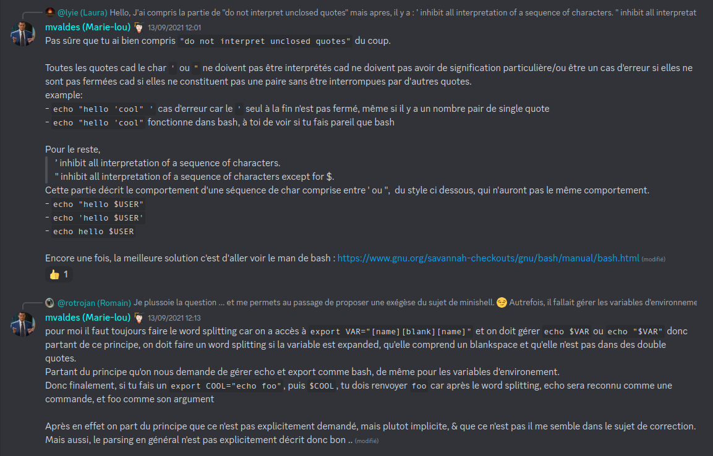

# gen notes

- [OK] test exec 
- [OK] modif ft_exec avec char *exec unique a envoyer dans mon ft_exec(modifer le get cmds)

# exec
- [OK] exit
- [ ] mettre en place la boulce exec qui prend en compte le tab de cmds
- [ ] gerer les redirs dans la structure de cmds

# parse
- [ ] ``minishell > grep 'coucou' |   | cat main.c `` > msg erreur
### env_del.c -> ft_env_del_elem
- [ ] !!! Est-ce qu'on peut delete tous les elements de l'env ?
- [ ] Si oui : techniquement si abs path les commandes doivent tjrs s'exec ?
- [ ] Donc est-ce que si on delete totalement, est-ce que free totalement l'env (ne doit pas etre une condition de check pour run __any__ fonction) ou est-ce qu'on remplace le premier node de la struct env en un pointeur non NULL qui est valable uniquement pour ce cas ? 
### parsing env
- [x] envp init
- [ ] envp init if not env (check what is expected before)(PWD, shell level and _)
- [x] display env
- [x] replace (or actualise) an env value function
- [ ] delete an env value function
- [ ] create an env value function (export)
- [x] free env struct fuction
### parsing cmd
- [ ] priorite : QUOTE HANDLER
- [ ] faire choix de struct pour le lexer ou include directement dans le parsing ?
- [ ] check if using ' "
- [ ] cas d'erreur qui fait que la commande s'arrete au parsing et non exec ?
- [ ] redirections

## Test cases (self Q&A)
### quoting

:arrow_right::arrow_right: Est-ce que ca rentre dans le sujet

[Discord link to this message](https://discord.com/channels/774300457157918772/785407549725736971/886914406712238121)
[man bash](https://www.gnu.org/savannah-checkouts/gnu/bash/manual/bash.html)

## parse doc links
- [is * a wildcard](https://hbctraining.github.io/Intro-to-shell-flipped/lessons/02_wildcards_shortcuts.html#:~:text=The%20Shell%20(bash)%20considers%20an,the%20most%20for%20our%20exercises.)